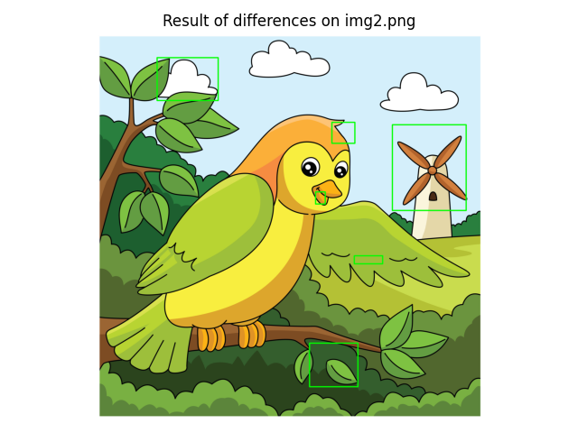

# Change Detection Verktyg

Av Niclas Hansson
2026-09-01

Detta projekt implementerar ett automatiserat **förändringsdetekteringssystem** för att jämföra två bilder (finn-x-fel). Systemet identifierar skillnader genom kantdetektion och patch-matchning.
Uppgiften var rätt rolig så jag har även implementerat lite extra funktionalitet för att kunna experimentera med  augmentering (brus och ljusvariationer), smidigt filhanteringssystem (json), felhanteringssystem (log), samt extra funktionalitet för att slå ihop regioner. Den intressanta biten, detektorn, ligger i change_detection.py. Övriga filer innehåller mindre hjälpfunktioner för att göra livet lite enklare. Configfilen är satt till att köra grundfunktionaliteten.

Uppgiften gick att lösa med relativt enkla metoder. Jag valde dock att implementera en något mer generell pipeline för att visa hur jag strukturerar ett datorseendeproblem och hur lösningen kan utökas för att hantera exempelvis brus, ljusvariationer eller mindre geometriska skillnader.

---
## Begränsningar

Jag har utgått från en windowsdator och inte implementerat någon kod för olika OS. Pathsen i config-filen är relativa och bör kunna ändras för att fungera för ditt OS.
Programmet bör kunna köras oberoende av mjukvara.


---

## Grundfunktionalitet

- Upptäcker skillnader mellan en **referensbild (ref)** och **förfrågningsbilder (queries)**.

- Stöder flera **edgedetection-metoder**:
  - Canny
  - Sobel
  - Laplacian
  - Scharr
- Använder kantdetektionen för att fenerera connected components och skapa bounding boxes runt de detekterade felen.


## Extra funktionalitet

- Loggar felmeddelanden
- Sparar resultat som **JSON-filer** och visualiserar bounding boxes.
- Hanterar **ljusvariationer** och **Gaussiskt brus**.
- Använder **SSIM och ORB** för patchmatchning för att minska falska positiva.
- Slår samman **ROIs** för överlappande eller förflyttade objekt.

---

## Metodval

Då det endast finns två bilder och felen är relativt lätta att detektera har jag valt en mer klassisk approach. 
Argument kan föras för att man kan gå deep-learning hållet med någon zero shot change detector men resultatet blir mindre intressant att diskutera på så lite testdata.

Jag har valt att implementera en edge detector från OpenCV (Canny) som hittar kanter i bilder. Detta passar bra då bilderna har hög kontrast och lågt brus. Först samplas bilderna ned till (640,480) för att det är tillräckligt bra upplösning för att lösa denna uppgiften och beräkningarna går snabbare. Avstånden från kant i bild 1 (ref)
till närmsta kant i bild 2 (query) beräknas och man får ut en distanskarta över skillnaderna mellan query och ref. Samma beräkning görs om vänt från query till ref. Avstånden omvandlas till en binär bild.

I den binära bilden hittas och labelas sammansatta komponenter (connected components). Varje komponent blir en binär box och testas patchvis, alltså patch i query testas mot samma område i ref för att se om det är en bra matchning, är det en matchning klassas det som en falsk positiv och plockas bort ur urvalet av komponenter. Matchningen görs med SSIM, då SSIM är känsligt mot brus och intensitetsvariationer passade jag på att implementera en ORB descriptor som kan avgöra om det är en matchning i tvetydiga fall. 

De resulterade boxarna uppsamplas och läggs på originalbilden (query).

## Resultat

Resultatet visas i bild nedan.


Som synes detekteras samtliga fel men samma objekt markeras av flera boxar. Vissa fel ger upphov till flera fel, ex. det förflyttade lövet blir två fel då det är både ett "saknat objekt" (från originalpositionen) och ett nytt "objekt" (på nya positionen). För att motverka detta implementerade jag utöver grundfunktionaliteten in box_merging-logik samt en check om objekt har flyttats från en scen till en annan. Logiken är simpel, om boxarna är tillräckligt överlappande mergeas de ihop, eller om två boxar har samma storlek tillräckligt nära varandra anses de vara ett förflyttat objekt (lövet). Och genom att tweeka parametrarna kan man få ut exakt 6 boxar.



Jag står dock fast vid min ursprungslösning är good enough. Givet att man inte vet hur många fel det är finns det en risk att man översamplar detektionerna.
En annan möjlig, mer enkel lösning, skulle kunna vara att låta alla boxar utgöra en binär mask och dra ut kopplade komponenter från den, då skulle man få ut 8 komponenter. Det beror helt enkelt på om man är intresserade av "alla fel i ett område", eller "specifika positioner där fel finns", där jag valt det senare alternativet. Exempelvis är det inte klargjort ifall lövet räknas som ett eller två fel (annat än att uppgiften heter finn-sex-fel).

## Reflektioner

Detektorn fungerar bra i detta fallet. Den är simpel, deterministisk och robust. Koden (tycker jag) är lätt att bygga vidare på, exempelvis gick det snabbt att lägga till val av kantdetector.
Anledningen att jag gjorde en kantdetektor istället för att använda SSIM eller något liknande direkt är att den är (potentiellt) mer robust mot brus. Om man lägger på brus på query så ökar antalet falska positiva, men den detekterar fortfarande samtliga originalfel (så långt som jag testat). 

Brus och illuminansvariation borde kunna fixas i en produktionsmiljö med bättre belysning, kamera och hårdvara. Jag testade att filtrera bort bruset med en gausisk kärna vilket förbättrade detektionerna något. Dock, eftersom jag har implementerat en kantdetector är detta ett suboptimalt ssätt att lösa problemet. Bättre med ett gradientbaserat brusfilter som bevarar kanterna, eller en unsupervised DL metod.

Det finns utrymme för ett preprocessing steg för att aligna bilderna om de inte är helt alignade, det finns viss robusthet mot små translationsfel då man kan thresholda distansmappen eller utföra mer morfologiska operationer (opening). Rotationsfel och större translationsfel är värre och hade behövt specifik logik för att rätta till.

Nackdelar med metoden är att den möjligen skulle generalisera dåligt om man byter target (produktionsbilderna består helt plötsligt istället av svaga kontraster och tunna kanter). Den är som nämnt ovan även känslig för brus utan ett filter. 

Eftersom att jag detekterar kanter är det svårt att hitta hela objekt. Molnet i övre vänstra hörnet detekteras gärna som två objekt, då det är två linjer som finns i query men inte i ref, om man inte är väldigt frikostig med regionsöverlappet. Boxarna riskerar även att bli felplacerade då de centreras runt kanterna istället för objektet. För att motverka detta skulle man behöva någon form av objektdetektion, watershedding, eller färgdetektion, där ursprungsboxarna kan utgöra startpositioner. Detta skulle speciellt behövas för väderkvarnen om man vill ha ner det på objektnivå.

En annan sak som borde utvecklas är detektionen av flyttade objekt, just nu är det endast "1 box i varje bild av ungefär samma storlek är tillräckligt nära" som är kravet. Man borde slå ihop det med patchmatching för att semantiskt avgöra om det är samma innehåll i båda boxarna. Man hade även kunnat göra det skalning- och rotationsinvariant med rätt descriptor.

Slutligen skulle jag vilja ha in feltyps-klassificering, men för det behövs ovan nämda metoder. Ex. "objekt tillagt" (molnet), "objekt felplacerat" (lövet), "objekt saknas" (vingen), "fel objekt" (väderkvarnen).

Hade det funnits mer data och tid hade jag förmodligen finetuneat en ViT modell, typ DinoV2, eller använt SAM (META) för att få ut regioner och jämföra dessa, om behovet hade varit en modell som generaliserar bättre.     

## Installation

0. Packa upp zipfilen.

1. Installera beroenden:
   ```bash
   pip install -r requirements.txt
   ```

---

## Användning

1. Konfigurera `config.py` med dina sökvägar och parametrar:
   ```python
        REF_SIZE = (640,480)
        SHOW_RESULTS = True
        REF_PATH = "data/reference/img1.png"
        QUERY_PATH = "data/query"
        SAVE_FILE = "results.json"
        USE_AUGMENTATION = False #Set to true for noisy images
        NOISE_MEAN = 0
        NOISE_SIGMA = 50
        NOISE_ITERATIONS = 1
        ILLUMINATION_BRIGHTNESS = 1.2
        ILLUMINATION_MEAN = 0
        ILLUMINATION_SIGMA = 10
        DETECTOR_PREPROCESS = False #Set to true for blurring images
        BLUR_KERNEL = 5
        BLUR_ITERATIONS = 20
        MERGE_KERNEL_SIZE = 0 #For better merging of bboxes increase
        OVERLAP_MODE = "fraction" # switch to "iou" for noisy images
        OVERLAP_THRESH = 0.7 # switch to 0.2 for exactly 6 boxes
        COMBINE_REGIONS = False #For handling overlapping boxes set to true
   ```

2. Kör huvudscriptet:
   ```bash
   python main.py
   ```

3. Resultat:
   - Upptäckta skillnader sparas som JSON-filer i `SAVE_FILE`.
   - Bounding boxes kan även visas över bilder.

---

## Mappstruktur

```
projekt/
├─ main.py                  # Huvudentré
├─ change_detection.py      # Core ChangeDetector-klass
├─ augmentations.py         # Ljus- och brusaugmenteringar
├─ draw_utils.py            # Visualiseringsfunktioner
├─ image_loader.py          # Funktioner för att läsa in bilder
├─ logger.py                # Loggning och felhantering
├─ config.py                # Projektkonfiguration
├─ output/
│  ├─ results/             # JSON-utdata
│  └─ logs/                # Fel-loggar
```

---

## Exempel

```python
from change_detection import ChangeDetector
import cv2

ref = cv2.imread("ref.png")
query = cv2.imread("query.png")

detector = ChangeDetector(ref)
detector.set_query(query)
detector.find_differences()
detections, sources = detector.filter_rois_by_patch_match(detector.get_rois(), detector.get_roi_sources())
```

## Noteringar

- Bounding boxes gäller **resizeade bilder**. Du kan skala dem tillbaka till originalstorlek om det behövs.
- Använd augmenteringsalternativen för att **simulera variationer i ljus och brus**.

